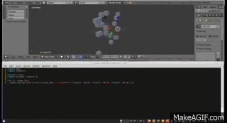

Live-coding [Blender](http://blender3d.org/) with [Hylang](http://hylang.org/).

[](https://www.youtube.com/watch?v=vRBdqsaKmuU)

### Running it

Tested under macOS, should work under Linux as well.

```bash
# note: this is probably not needed under macOS if you put Blender to /Applications/Blender.app 
# a pro tip: it is convenient to use direnv for this
export HYLC_BLENDER_PATH="/path/to/your/blender"
export HYLC_BLENDER_PYTHON_PATH="/path/to/your/blender/and/its/python"
```

* Run `./scripts/install-deps.sh` to install the Hy-lang dependencies in a place where Blender's internal Python can find them.
* Run `./scripts/blender.sh examples/one-hundred-cubes.hy` to start Blender watching one-hundred-cubes.hy and re-loading it whenever it changes.

### Connecting via nREPL

First you have to enable it via env: 

```bash
export HYLC_NREPL=1
```

Then running `blender.sh` should display `nREPL server listening on ('127.0.0.1', 1337)`, see below:

```text
> ./scripts/blender.sh examples/one-hundred-cubes.hy
HYLC_BLENDER_PATH=/Applications/Blender.app/Contents/MacOS/Blender
HYLC_BLENDER_PYTHON_PATH=/Applications/Blender.app/Contents/Resources/2.82/python
HYLC_LIVE_FILE=/Users/darwin/lab/blender-hylang-live-code/examples/one-hundred-cubes.hy
HYLC_NREPL=1
+ exec /Applications/Blender.app/Contents/MacOS/Blender assets/blank.blend --python /Users/darwin/lab/blender-hylang-live-code/src/watcher/main.py
Read prefs: /Users/darwin/Library/Application Support/Blender/2.82/config/userpref.blend
found bundled python: /Applications/Blender.app/Contents/Resources/2.82/python
Read blend: /Users/darwin/lab/blender-hylang-live-code/assets/blank.blend

==== hylc watcher =====
hy 0.18.0 using CPython(default) 3.7.4 on Darwin in Blender 2.82 (sub 7)
nREPL server listening on ('127.0.0.1', 1337)

Watching '/Users/darwin/lab/blender-hylang-live-code/examples/one-hundred-cubes.hy' for changes and re-loading.
Reloading '/Users/darwin/lab/blender-hylang-live-code/examples/one-hundred-cubes.hy'
Info: Deleted 0 object(s)
Done executing '/Users/darwin/lab/blender-hylang-live-code/examples/one-hundred-cubes.hy'
...
```

Then in another terminal session you can try to connect with `lein repl` and eval something:

```bash
> lein repl :connect 1337
Connecting to nREPL at 127.0.0.1:1337
HyREPL: hy 0.18.0 using CPython(default) 3.7.4 on Darwin in Blender 2.82 (sub 7)

Hy=> (+ 1 2)
3
Hy=>
```

My goal is to make this work with Cursive's remote nREPL support. Basic stuff works, but it needs more polish.


